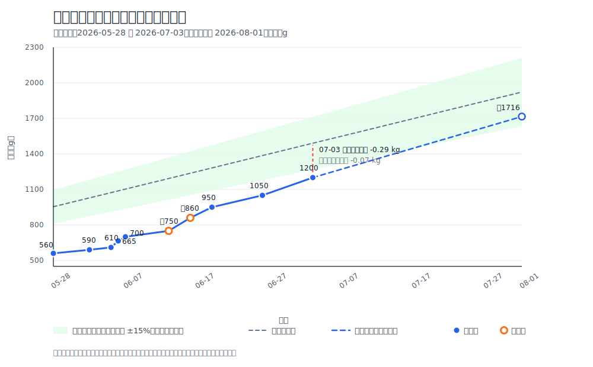

# 体重与成长

## 体重记录

| 日期 | 体重 | 测量方式 | 食欲 | 备注 |
| --- | --- | --- | --- | --- |
| 2026-05-30 | 560 g | 待确认 | 待确认 | 到家第一天 |
| 2026-06-02 | 590 g | 待确认 | 待确认 | 主人确认 |
| 2026-06-05 | 610 g | 待确认 | 待确认 | 主人确认 |
| 2026-06-06 | 665 g | 待确认 | 待确认 | 主人确认 |
| 2026-06-07 | 700 g | 待确认 | 待确认 | 主人确认 |
| 2026-06-13 | 约 750 g | 估计 | 待确认 | 由“6 月中旬”估计，精确日期无法补齐 |
| 2026-06-16 | 约 860 g | 估计 | 待确认 | 由“6 月中下旬”估计，精确日期无法补齐 |
| 2026-06-19 | 950 g | 待确认 | 待确认 | 主人确认 |
| 2026-06-26 | 1050 g | 待确认 | 待确认 | 体重突破 1 kg |
| 2026-07-03 | 1.2 kg | 待确认 | 待确认 | 接种硕腾妙三多第一针当天 |
| 2026-07-10 22:21 | 1300 g | 待确认 | 待确认 | 主人新增记录 |
| 2026-07-19 12:55 | 1420 g | 待确认 | 待确认 | 主人新增记录；当时进食和排泄状态待确认 |

## 体重变化折线图

- 图表更新时间：2026-07-19。
- 蓝色实心点为记录值；橙色空心点为估计值。
- 浅绿色区间为粗略参考带：以“幼猫 6 月龄前约每月 1 lb”为参考中心线，并用中心线 ±15% 做视觉对照；这不是兽医诊断上的正常范围。
- 蓝色虚线为按 2026-05-30 至 2026-07-19 总体平均增速的短期投影；橙色虚线为按 2026-07-10 22:21 至 2026-07-19 12:55 近期增速的短期投影。到 2026-08-01 约为 1.60-1.64 kg 区间。

## 成长观察

- 身形变化：从 2026-05-30 的 560 g 增长至 2026-07-19 的 1420 g。
- 毛发变化：头顶疑似猫癣区域脱毛后正在长毛；左脸和左手关节处未观察。
- 牙齿变化：待填写。
- 活动力变化：夜间明显活跃。

## 趋势小结

- 2026-05-30 到 2026-07-19：覆盖 51 个日历日期，标准日期差为 50 个完整日；从 560 g 增至 1420 g，增加 860 g（约 153.6%）。
- 因 2026-05-30 的称重时刻缺失，真实间隔约为 49.54-50.54 天，平均增速约 17.0-17.4 g/日；按日期差统一计算为 17.2 g/日。
- 2026-07-10 22:21 到 2026-07-19 12:55：从 1300 g 增至 1420 g，8 天 14 小时 34 分增加 120 g，折算约 13.9 g/日、97.6 g/周。短期变化仍会混入称重工具、进食和排泄差异。
- 体重增长速度较快；后续继续记录即可，不在公开仓库中做医疗判断。
- 2026-06-13 的约 750 g 和 2026-06-16 的约 860 g 是为了形成连续曲线而保留的估计日期，不再追溯精确日期。

## 2026-07-19 体重判断

- 已记录事实：小咪出生于 2026-03-25，2026-07-19 12:55 体重 1420 g，当时为 3 个月 24 天；2026-05-30 到 2026-07-19 增加 860 g。按标准日期差 50 天计算为 17.2 g/日；考虑起点时刻未知，约为 17.0-17.4 g/日。
- 推测/建议：按现有粗略参考带，小咪当前体重仍可能在同龄幼猫偏低一侧；2026-07-19 体重 1.42 kg，粗略参考中心约 1.73 kg，差约 0.31 kg；与参考带下沿约 1.47 kg 差约 0.05 kg。但她仍在持续增重，现有节点没有停滞或下降，不能只凭单个体重数字判断营养或健康状态。
- 增速变化：2026-07-10 22:21 到 2026-07-19 12:55 增加 120 g，折算约 13.9 g/日，仍在此前引用的常见幼猫生长参考范围内。是否符合小咪自身理想生长，需要结合称重条件、体况、食欲、精神和排便连续判断。
- 短期投影：若按全周期平均增速，到 2026-08-01 约 1.64 kg；若按最近两个精确时刻之间的增速，到 2026-08-01 约 1.60 kg。投影只用于观察趋势，不作为目标体重。
- 观察重点：继续每周固定时间称重，并同时记录食欲、精神、排便、体况触感；如果出现体重停滞或下降、食欲下降、持续软便/呕吐、精神差，建议带记录咨询兽医。
- 医疗提示：体重和发育判断以兽医面诊、体况评分和完整健康检查为准。
- 参考来源：Royal Canin 幼猫体重与体况文章（理想体重是范围，幼猫生长期约 10-15 g/日、2-4 月龄约 100 g/周增长）；ASPCApro 幼猫年龄与体重表（正常幼猫约 7-15 g/日增长）；Bond Vet 幼猫成长参考（3 月龄约 3 lb / 1.36 kg 的粗略参考点，需结合品种、性别和体况）。
