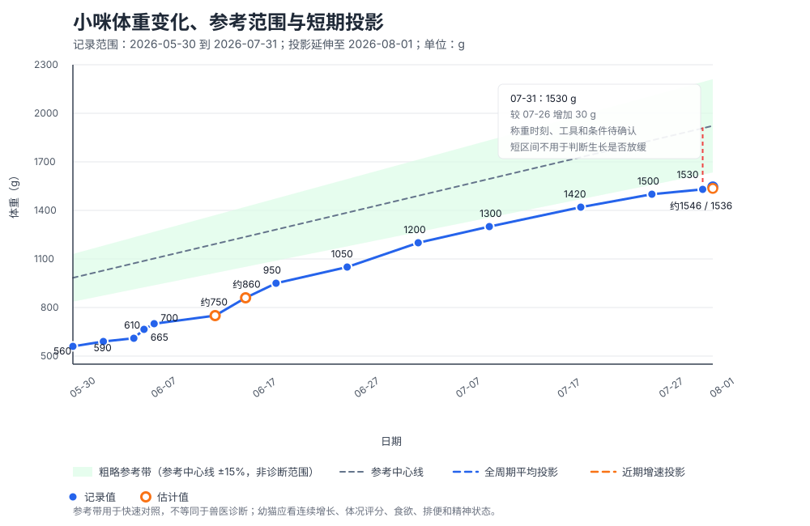

# 体重与成长

## 体重记录

| 日期 | 体重 | 测量方式 | 食欲 | 备注 |
| --- | --- | --- | --- | --- |
| 2026-05-30 | 560 g | 待确认 | 待确认 | 到家第一天 |
| 2026-06-02 | 590 g | 待确认 | 待确认 | 主人确认 |
| 2026-06-05 | 610 g | 待确认 | 待确认 | 主人确认 |
| 2026-06-06 | 665 g | 待确认 | 待确认 | 主人确认 |
| 2026-06-07 | 700 g | 待确认 | 待确认 | 主人确认 |
| 2026-06-13 | 约 750 g | 估计 | 待确认 | 由“6 月中旬”估计，精确日期无法补齐 |
| 2026-06-16 | 约 860 g | 估计 | 待确认 | 由“6 月中下旬”估计，精确日期无法补齐 |
| 2026-06-19 | 950 g | 待确认 | 待确认 | 主人确认 |
| 2026-06-26 | 1050 g | 待确认 | 待确认 | 体重突破 1 kg |
| 2026-07-03 | 1.2 kg | 待确认 | 待确认 | 接种硕腾妙三多第一针当天 |
| 2026-07-10 22:21 | 1300 g | 待确认 | 待确认 | 主人新增记录 |
| 2026-07-19 12:55 | 1420 g | 待确认 | 待确认 | 主人新增记录；当时进食和排泄状态待确认 |
| 2026-07-26 12:03 | 1500 g | 待确认 | 待确认 | 主人新增记录；当时进食和排泄状态待确认 |
| 2026-07-31 | 1530 g（1.53 kg） | 接种前称重；其他条件待确认 | 待确认 | 主人确认在接种第二针疫苗前称重；测量时间、工具/地点及当时进食和排泄状态待确认 |

## 体重变化折线图

- 图表更新时间：2026-07-31。
- 蓝色实心点为记录值；橙色空心点为估计值。
- 浅绿色区间为粗略参考带：以“幼猫 6 月龄前约每月 1 lb”为参考中心线，并用中心线 ±15% 做视觉对照；这不是兽医诊断上的正常范围。
- 蓝色虚线为按 2026-05-30 至 2026-07-31 总体平均增速的短期投影；橙色虚线为按 2026-07-26 12:03 至 2026-07-31 近期增速的短期投影。由于最新称重时刻待确认，投影只作趋势展示，不作为目标体重。

## 成长观察

- 身形变化：从 2026-05-30 的 560 g 增长至 2026-07-31 的 1530 g。
- 毛发变化：头顶疑似猫癣区域脱毛后正在长毛；左脸和左手关节处未观察。
- 牙齿变化：待填写。
- 活动力变化：夜间明显活跃。

## 趋势小结

- 2026-05-30 到 2026-07-31：覆盖 63 个日历日期，标准日期差为 62 个完整日；从 560 g 增至 1530 g，增加 970 g（约 173.2%）。按日期差折算约 15.6 g/日；起点和终点称重时刻、工具均不完整，不能把它当成精确生理增速。
- 2026-07-26 12:03 到 2026-07-31：从 1500 g 增至 1530 g，增加 30 g。按日期差约 6.0 g/日，但终点时刻和测量条件待确认，短区间不用于判断生长是否放缓。
- 体重仍在持续增长；后续继续记录即可，不在公开仓库中做医疗判断。
- 2026-06-13 的约 750 g 和 2026-06-16 的约 860 g 是为了形成连续曲线而保留的估计日期，不再追溯精确日期。

## 2026-07-31 体重判断

- 已记录事实：小咪出生于 2026-03-25，2026-07-31 接种第二针前称重 1530 g，当天约 4 个月 6 天；较 2026-07-26 的 1500 g 增加 30 g。测量时间、工具/地点及当时进食/排泄状态待确认。
- 推测/建议：这一次仍是正增长，但 5 天内的 30 g 和不同测量条件不能单独说明生长速度是否理想；体重应和体况评分、食欲、精神、排便一起由兽医判断。不要把粗略参考带当作诊断范围。
- 观察重点：继续用同一工具、相近时间每周称重，并记录食欲、精神、排便和体况触感；如果体重连续停滞/下降，或伴随食欲下降、持续软便/呕吐、精神差，带记录咨询兽医。
- 医疗提示：体重和发育判断以兽医面诊、体况评分和完整健康检查为准。
- 参考来源：Royal Canin 幼猫体重与体况文章（理想体重是范围，幼猫生长期约 10-15 g/日、2-4 月龄约 100 g/周增长）；ASPCApro 幼猫年龄与体重表（正常幼猫约 7-15 g/日增长）；Bond Vet 幼猫成长参考（3 月龄约 3 lb / 1.36 kg 的粗略参考点，需结合品种、性别和体况）。
