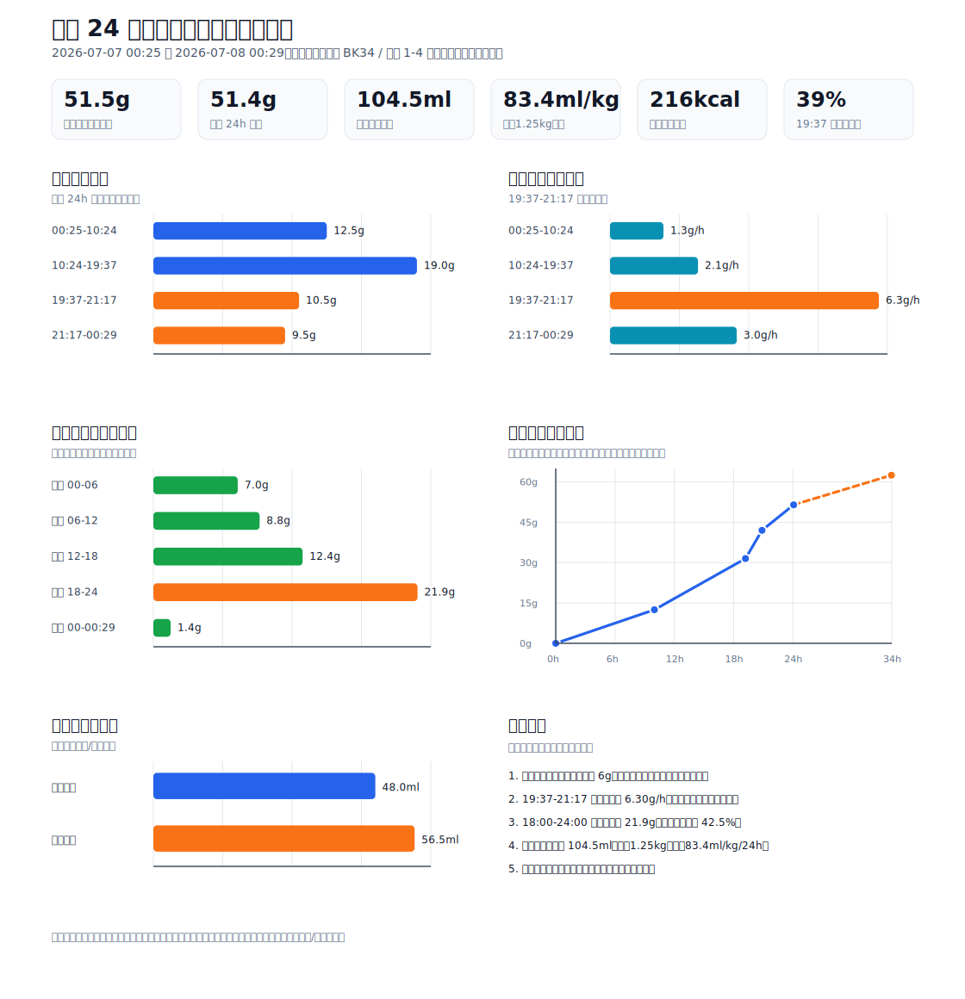

# 2026-07-07 24 小时饮食饮水专业分析

## 结论摘要

观察窗口为 2026-07-07 00:25 至 2026-07-08 00:29，共 24 小时 4 分钟。主食为皇家奶糕 BK34 / 皇家 1-4 月龄离乳期幼猫全价奶糕，中间有几次冻干奖励，未计入猫粮克数。

核心结论：

- 猫粮消耗 51.5 g，折算 51.4 g/24h。
- 若按同系列约 4.2 kcal/g 粗算，猫粮提供约 216 kcal/24h；冻干奖励会让真实热量略高。
- 两只水碗合计减少 104.5 ml，折算 104.2 ml/24h。该数值是“水碗减少量”，包含蒸发、溅出、沾毛等误差，不等于精确饮水量。
- 观察窗口介于 2026-07-03 的 1.2 kg 与 2026-07-10 22:21 的 1.3 kg 之间，每公斤折算按约 1.25 kg 估算；水碗减少量约 83.4 ml/kg/24h。
- 19:37 至 00:29 是明显进食高峰，4 小时 52 分内吃了 20.0 g，占核心 24 小时摄入的 38.8%。
- 19:37 至 21:17 是最高速区间，约 6.30 g/h，是 00:25 至 10:24 区间的约 5.0 倍。
- 猫粮碗从未被吃空，核心窗口内最低剩余实际猫粮约 6 g，说明自助采食期间食物始终可得。
- 当前这组数据不支持“饮水不足”或“吃粮不足”的判断。更适合的下一步是连续测 3 天，并同步记录尿团、大便、精神、体重。

可视化总图：

## 数据文件

- 区间猫粮摄入：[`2026-07-07_food_intervals.csv`](../data/2026-07-07_food_intervals.csv)
- 按时段估算分布：[`2026-07-07_clock_distribution.csv`](../data/2026-07-07_clock_distribution.csv)
- 水碗变化：[`2026-07-07_water_bowls.csv`](../data/2026-07-07_water_bowls.csv)
- 累计猫粮摄入曲线：[`2026-07-07_cumulative_food.csv`](../data/2026-07-07_cumulative_food.csv)

## 观察条件

| 项目 | 数值 |
| --- | --- |
| 核心观察窗口 | 2026-07-07 00:25 至 2026-07-08 00:29 |
| 核心窗口长度 | 24 小时 4 分钟 |
| 后续观察窗口 | 2026-07-08 00:29 至 2026-07-08 10:23 |
| 后续窗口长度 | 9 小时 54 分钟 |
| 猫粮空碗 | 200 g |
| 白色水碗空碗 | 430 g |
| 黄色水碗空碗 | 407 g |
| 当时参考体重 | 观察窗口位于 2026-07-03 约 1.2 kg 与 2026-07-10 22:21 1.3 kg 之间，按趋势粗略插值约 1.25 kg |
| 零食 | 几次冻干奖励，未计入主食克数 |

## 原始称重

| 时间 | 猫粮总重 | 操作 | 白色水碗总重 | 黄色水碗总重 | 换算说明 |
| --- | --- | --- | --- | --- | --- |
| 2026-07-07 00:25 | 220 g | 起始记录 | 642 g | 571.5 g | 猫粮实际 20 g；白碗水 212 g；黄碗水 164.5 g |
| 2026-07-07 10:24 | 207.5 g | 补到 225 g | 未称 | 未称 | 猫粮实际剩 7.5 g |
| 2026-07-07 19:37 | 206 g | 补到 220 g | 未称 | 未称 | 猫粮实际剩 6 g |
| 2026-07-07 21:17 | 209.5 g | 补到 220 g | 未称 | 未称 | 猫粮实际剩 9.5 g |
| 2026-07-08 00:29 | 210.5 g | 补到 225 g；水碗清空后补水 | 594 g，清空后补到 672 g | 515 g，清空后补到 603 g | 猫粮实际剩 10.5 g；白碗水剩 164 g；黄碗水剩 108 g |
| 2026-07-08 10:23 | 214 g | 补到 226 g | 未称 | 未称 | 猫粮实际剩 14 g |

## 区间摄入

| 区间 | 时长 | 猫粮消耗 | 占核心 24h 比例 | 摄入速度 | 相对 00:25-10:24 倍数 | 补粮后消耗比例 |
| --- | --- | --- | --- | --- | --- | --- |
| 00:25-10:24 | 9 小时 59 分 | 12.5 g | 24.3% | 1.25 g/h | 1.0x | 62.5% |
| 10:24-19:37 | 9 小时 13 分 | 19.0 g | 36.9% | 2.06 g/h | 1.6x | 76.0% |
| 19:37-21:17 | 1 小时 40 分 | 10.5 g | 20.4% | 6.30 g/h | 5.0x | 52.5% |
| 21:17-00:29 | 3 小时 12 分 | 9.5 g | 18.4% | 2.97 g/h | 2.4x | 47.5% |
| 00:29-10:23 | 9 小时 54 分 | 11.0 g | 后续窗口 | 1.11 g/h | 0.9x | 44.0% |

解读：

- 10:24-19:37 的绝对摄入量最高，为 19.0 g，但这是一个较长区间。
- 19:37-21:17 的单位时间摄入速度最高，说明小咪在傍晚/夜间进入明显进食高峰。
- 21:17-00:29 速度仍高于白天早段，说明夜间活跃和进食存在关联。
- 00:29-10:23 后续窗口只吃 11.0 g，上午摄入较慢，符合白天偏睡的既往观察。

## 时段分布估算

下表按 00-06、06-12、12-18、18-24 切分。因为没有每小时称重，所以这里假设每个称重区间内进食速度均匀，仅用于观察节律，不是精确进食时间。

| 时段 | 覆盖时长 | 估算摄入 | 占核心 24h 比例 | 估算速度 |
| --- | --- | --- | --- | --- |
| 凌晨 00-06 | 5.58 h | 6.99 g | 13.6% | 1.25 g/h |
| 上午 06-12 | 6.00 h | 8.81 g | 17.1% | 1.47 g/h |
| 下午 12-18 | 6.00 h | 12.37 g | 24.0% | 2.06 g/h |
| 晚上 18-24 | 6.00 h | 21.90 g | 42.5% | 3.65 g/h |
| 次日 00-00:29 | 0.48 h | 1.43 g | 2.8% | 2.97 g/h |

聚合视角：

| 视角 | 估算摄入 | 占比 | 解读 |
| --- | --- | --- | --- |
| 白天段 06:00-18:00 | 21.18 g | 41.1% | 进食稳定，但速度不高 |
| 晚上段 18:00-24:00 | 21.90 g | 42.5% | 单独 6 小时几乎吃掉全天 4 成以上 |
| 晚间高峰 19:37-00:29 | 20.00 g | 38.8% | 与夜间活跃模式高度一致 |
| 广义夜间 18:00-00:29 + 00:25-06:00 | 30.32 g | 58.9% | 夜间/凌晨摄入占主导，但其中一部分为估算 |

判断：小咪不是均匀少量进食，而是白天慢吃、傍晚到夜间集中进食。这和“白天偏睡、晚上精神”的行为基线一致。

## 自助采食稳定性

| 指标 | 结果 | 解读 |
| --- | --- | --- |
| 核心窗口是否吃空 | 否 | 没有出现空碗导致的被迫断食 |
| 最低猫粮剩余 | 约 6 g | 出现在 2026-07-07 19:37 |
| 最大单区间消耗比例 | 76.0% | 10:24 补到 225 g 后，到 19:37 吃了 19 g |
| 最高摄入速度 | 6.30 g/h | 19:37-21:17 |
| 后续上午速度 | 1.11 g/h | 上午偏慢，符合白天偏睡 |

结论：当前补粮方式不会让小咪长时间无粮；自助采食可继续。若以后想更精确控制，可以改为固定时间称重，不必频繁补到不同目标重量。

## 热量粗估

| 项目 | 估算 |
| --- | --- |
| 猫粮摄入 | 51.5 g / 24 小时 4 分钟 |
| 折算 24h | 51.4 g/24h |
| 粗估代谢能 | 约 4.2 kcal/g，实际以包装为准 |
| 猫粮热量 | 约 216 kcal/24h |
| 按约 1.25 kg 折算 | 约 173 kcal/kg/24h |
| 冻干奖励 | 未计入，真实热量略高 |

如果用静息能量需求 RER 粗算，1.25 kg 的 RER 约为 83 kcal/日。幼猫生长期通常需要 RER 的数倍，当前猫粮热量约为 2.6 倍 RER，再加上少量冻干，和生长期需求方向一致。这个估算只能用于家庭记录，不能替代兽医体况评分。

## 饮水分析

| 水碗 | 起始实际水量 | 结束实际水量 | 减少量 | 减少量占比 |
| --- | --- | --- | --- | --- |
| 白色水碗 | 212 ml | 164 ml | 48.0 ml | 45.9% |
| 黄色水碗 | 164.5 ml | 108 ml | 56.5 ml | 54.1% |
| 合计 | 376.5 ml | 272 ml | 104.5 ml | 100% |

折算：

- 104.5 ml / 24 小时 4 分钟，折算约 104.2 ml/24h。
- 按观察窗口估算体重约 1.25 kg 折算，约 83.4 ml/kg/24h 的“水碗减少量”。
- 白碗减少 48.0 ml，黄碗减少 56.5 ml，目前不能说明明显偏好；两碗位置、温度、蒸发、溅水都可能影响结果。

误差情景：

| 假设非饮用损耗 | 估算实际饮水 | 按约 1.25 kg 折算 |
| --- | --- | --- |
| 0% | 104.2 ml/24h | 83.4 ml/kg/24h |
| 10% | 93.8 ml/24h | 75.0 ml/kg/24h |
| 20% | 83.4 ml/24h | 66.7 ml/kg/24h |
| 30% | 72.9 ml/24h | 58.3 ml/kg/24h |

对照 VCA 的基础估算，健康猫可用约每 5 磅体重 4 盎司水作为粗略基线。折算到约 1.25 kg，大约是 65 ml/日左右。即使假设有 30% 非饮用损耗，小咪的估算饮水仍接近该基线；如果损耗较小，则高于基线。考虑到她吃的是干粮，这个结果并不异常。

## 风险和观察点

当前数据本身不提示明显异常，但后续要结合排泄和精神状态看：

| 观察项 | 当前判断 | 需要警惕的变化 |
| --- | --- | --- |
| 食量 | 51.4 g/24h，稳定 | 连续下降、突然拒食、只吃零食不吃主粮 |
| 饮水 | 水碗减少量不低 | 突然大幅增加或减少，尤其伴随尿团变化 |
| 夜间进食 | 晚间高峰明显 | 若夜间过度兴奋伴随攻击、呕吐或腹泻，需要记录 |
| 尿团 | 本次未同步称重 | 尿团明显变大/变多，或频繁进出猫砂盆 |
| 大便 | 本次未同步记录 | 持续软便、腹泻、便秘、挂屁股 |
| 体重 | 需继续每周称 | 体重停滞、下降，或增长过快伴随体况异常 |

## 下一轮测量方案

建议连续 3 天执行同一套测量，这样可以得到更稳定的平均值和波动范围。

### 最低成本方案

1. 每天固定 00:30 和 10:30 称猫粮、水碗。
2. 每次称重前后都记录是否补粮、补到多少。
3. 冻干奖励记录粒数或克数。
4. 每天记录尿团数量、大便形态、呕吐、软便、精神状态。

### 更精确方案

1. 每 6 小时称一次：00:30、06:30、12:30、18:30。
2. 水碗旁放托盘，记录是否有明显泼洒。
3. 放一个小咪够不到的对照水碗，估算蒸发量。
4. 保持碗位置、碗型、室温、换水时间一致。
5. 每天同一时间称小咪体重，每周记录到 `03_health/weight_growth.md`。

## 专业结论

基于这一次 24 小时称重，小咪的主食摄入、饮水和昼夜节律整体是协调的：她在自助采食条件下没有吃空碗，全天猫粮摄入量在同龄幼猫喂食建议附近，夜间摄入更集中，饮水量不低。最值得继续跟踪的不是“今天是否吃够”，而是连续 3-7 天的趋势：食量均值、夜间峰值是否稳定、饮水是否突然变化、尿团和大便是否同步稳定。

当前不建议仅凭这一天数据调整主食量或强行限制夜间进食。继续记录即可。

## 参考来源

- Royal Canin Mother & Babycat feeding guide：`https://www.royalcanin.com/ae/cats/products/retail-products/mother-%26-babycat-2544`
- VCA cat water intake reference：`https://vcahospitals.com/resources/preventive-cat/nutrition/tips-to-encourage-cats-to-drink-more-water`
- Cornell Feline Health Center hydration：`https://www.vet.cornell.edu/departments-centers-and-institutes/cornell-feline-health-center/health-information/feline-health-topics/hydration`
